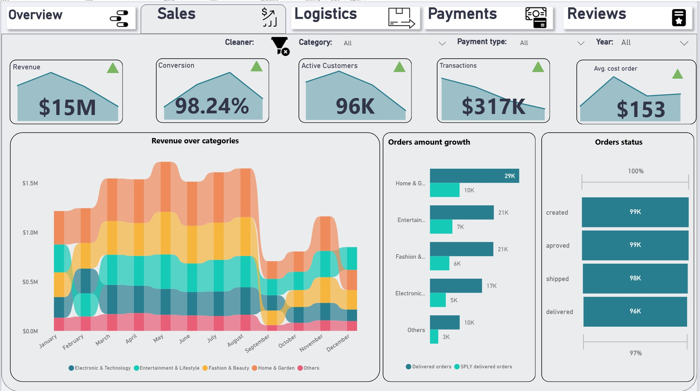

## 🛒 Project 2: Superstore Activity Analysis (Power BI)

**Objective:** Comprehensive analysis of an E-commerce business, focusing on sales trends, logistics efficiency, and customer satisfaction (NPS).

### 🖼️ Dashboard Preview

*(Am pus poza 2 ca principală deoarece acel Ribbon Chart este foarte vizual și atractiv)*

### 🧩 Key Features
* **Sales Trends:** Utilized a **Ribbon Chart** to visualize rank changes across product categories over time.
* **Logistics & Delivery:** Monitored order status funnels and delivery processing times to identify bottlenecks.
* **Customer Sentiment (NPS):** Analyzed Net Promoter Score and correlations between product description length and customer reviews.
* **Cash Flow:** Tracked installment payments and revenue distribution using stacked charts.
* **Geospatial Analysis:** Mapped revenue and customer distribution across regions.

### 📂 File Structure
* `Superstore_activity.pbix`: Full Power BI report.

👉 **[Click here to browse Project 2 files](02_Superstore_activity/)**