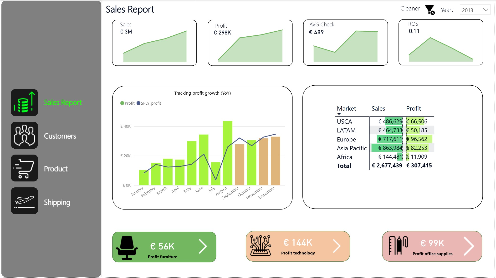
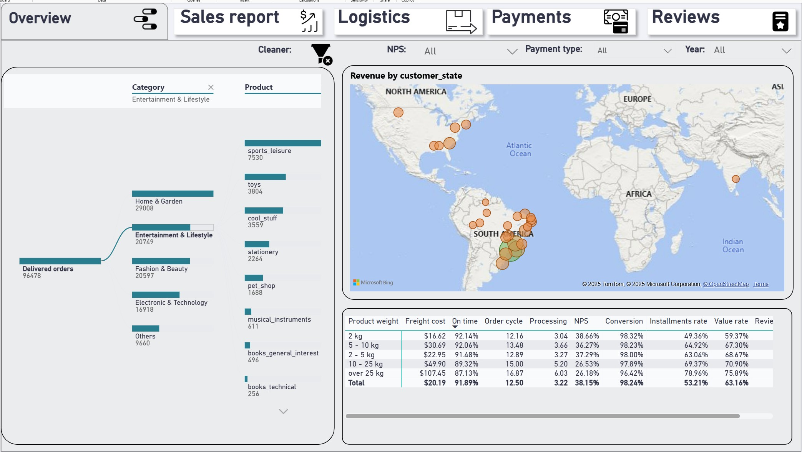

# 📊 Iurie Stratulat - Data Analytics Portfolio

Welcome to my portfolio! Here I document my journey in data analytics, featuring projects in **Power BI**, **Excel**, and **Google Sheets**.

---

## 🚀 Project 1: Global Sales & Logistics Report (Power BI)

**Objective:** Transform raw sales data into an interactive dashboard to identify profit drivers and shipping inefficiencies.

### 🖼️ Dashboard Preview

### 🧩 Key Features
* **Logistics Optimization:** Used **Decomposition Tree** AI visual to break down shipping costs and return rates by region and mode.
* **Profitability Analysis:** Identified that while "Furniture" drives volume, "Technology" drives profit margins (ROS).
* **Navigation:** Created a custom app-like sidebar for seamless switching between Sales, Product, and Shipping views.
* **Time Intelligence:** Implemented DAX measures for Year-over-Year (YoY) growth comparison.

### 📂 File Structure
* `Sales_Project.pbix`: The complete Power BI file.
* `Data Source (Excel)`: Raw datasets used for this analysis.

👉 **[Click here to browse Project 1 files](01_Sales_Project/)**

---

## 🛒 Project 2: Superstore Activity Analysis (Power BI)

**Objective:** Analyze customer purchasing behavior, payment methods, and delivery performance.

### 🖼️ Dashboard Preview

### 🧩 Key Features
* **Customer Behavior:** Analyzed revenue by customer state and payment preferences.
* **Delivery Analysis:** Tracked delivery status (On Time vs Overdue) and processing days.
* **Cash Flow:** Visualized revenue streams over time using stacked charts.

### 📂 File Structure
* `Superstore_activity.pbix`: Full Power BI report.

👉 **[Click here to browse Project 2 files](02_Superstore_activity/)**

---
*Connect with me on [LinkedIn](https://www.linkedin.com/in/iurie-stratulat/)*